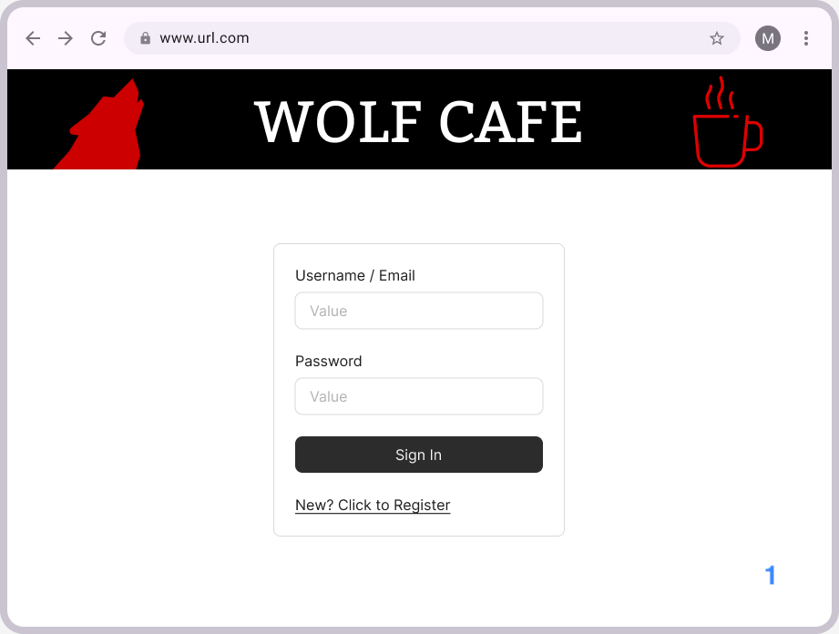
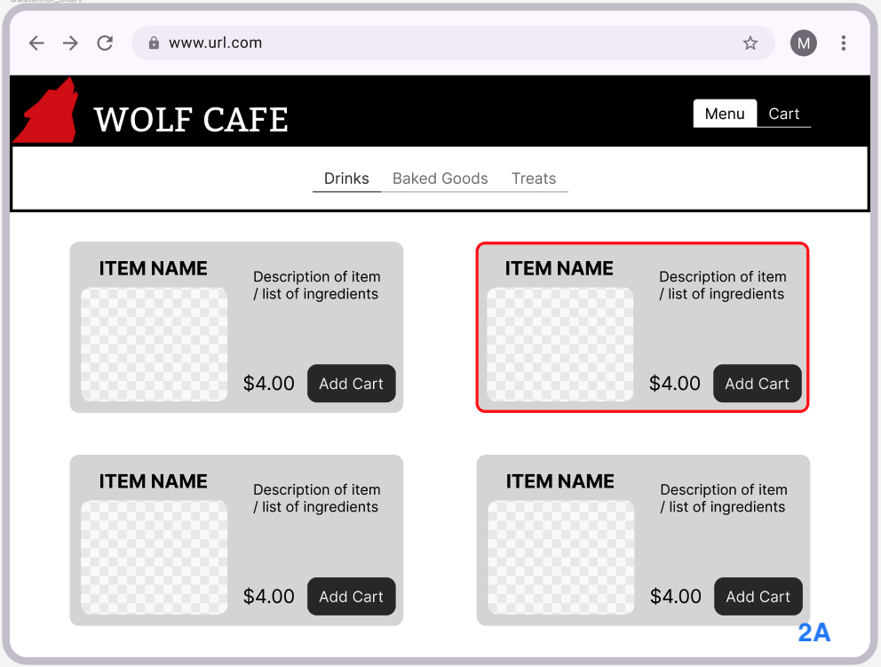
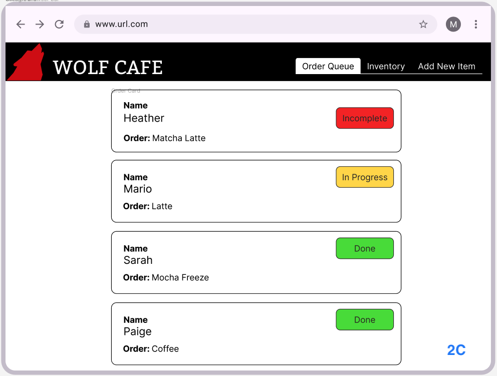
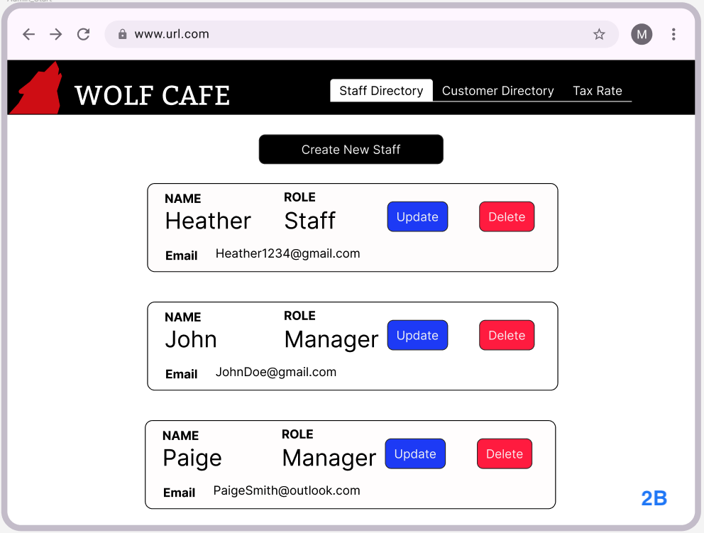

# WolfCafe Project Summary

Full-stack cafe ordering web application built with React, Spring Boot, MySQL, REST APIs, and JWT authentication.

## Overview

WolfCafe is a team software engineering project for managing cafe orders, inventory, users, and role-based workflows. The application supports different user roles such as customer, staff, and admin.

## Tech Stack

- React
- Spring Boot
- MySQL
- REST APIs
- JWT Authentication
- Git/GitHub
- Frontend testing

## My Contributions

- Contributed to backend UML design, REST API planning, and system architecture decisions
- Helped design and implement role-based workflows for customers, staff, and administrators
- Worked on frontend-backend integration using React, Spring Boot, JWT authentication, and REST APIs
- Assisted with order management, permissions, and inventory-related workflows
- Participated in Agile development, GitHub issue tracking, testing, inspections, and iterative feature development
- Added automated frontend tests and helped debug frontend/backend communication issues

## Key Features

- Customer order placement and pickup flow
- Staff order fulfillment workflow
- Role-based access control
- Inventory and menu management
- Authentication using JWT
- Automated frontend testing

## Screenshots

[View full UML diagram](images/uml.jpeg)

## What I Learned

This project strengthened my experience with full-stack development, API integration, authentication, Agile teamwork, testing, and building user-focused software in a collaborative environment.
